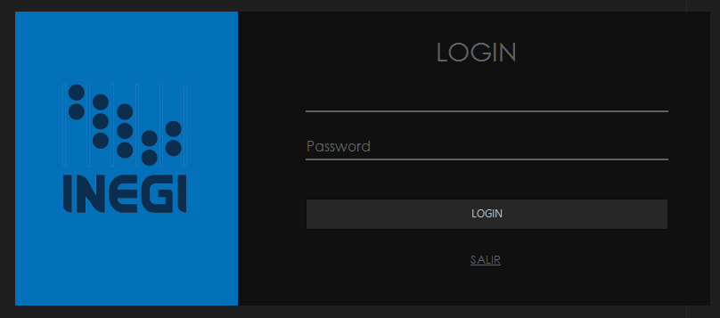

# Censo de Población
Este proyecto es una aplicación desarrollada en C# con el patrón MVC para administrar y visualizar los datos recopilados en un censo de población para el estado. Su principal objetivo es proporcionar una herramienta robusta y fácil de usar para registrar y analizar datos sobre viviendas y habitantes.

## Características principales:
- **Registro de Viviendas:** Permite registrar las viviendas del estado, incluyendo información sobre su dirección, tipo de construcción, y ubicación (municipio y localidad).
- **Registro de Habitantes:** Facilita la entrada de datos de los habitantes del estado, como nombre, fecha de nacimiento, género, y la vivienda en la que residen.
- **Actividades Económicas:** Proporciona una visión de las actividades económicas que sostienen a cada vivienda, permitiendo múltiples actividades por vivienda.
- **Municipios y Localidades:** Contiene catálogos de municipios y localidades del estado, facilitando el registro y la consulta de datos geográficos.
- **Autenticación:** Posee un sistema de inicio de sesión para administradores, garantizando la seguridad y la integridad de los datos.

------------
El proyecto fue creado como parte de un trabajo académico y tiene como objetivo principal la acumulación y análisis de datos de miles de viviendas y millones de habitantes en el estado.

## Requerimientos Técnicos
- **Sistema Operativo:** Windows 
- **Framework:** .NET Framework 7.0
- **Base de Datos:** MySQL 8.0

